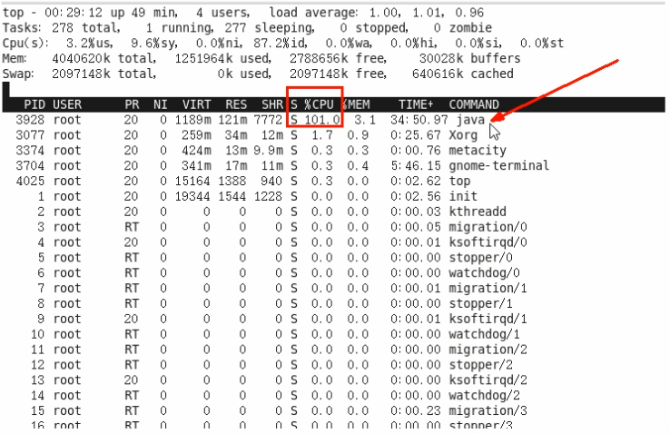
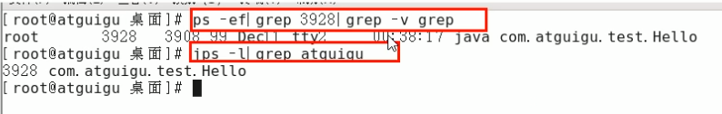
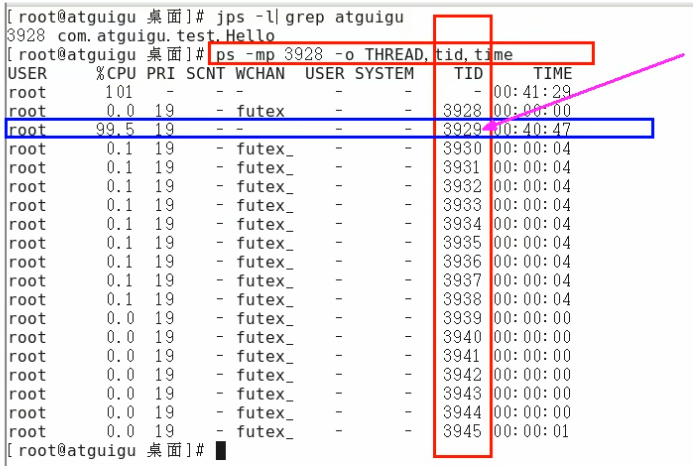

### CPU占用过高的定位分析思路
##### 1、top找出CPU占比最高的Java进程

```text
uptime: 简易版系统负载
load average: 1、5、10 分钟的负载 如果3个相加 / 3 百分占比>60就说明服务器已经负荷
```

##### 2、ps -ef或者jps进一步定位，进一步查看是哪个服务的进程
```text
截图可能不准确,两个命令均可
1、jps -l 列出所有java进程（要找你部署的那个java服务进程Id）
2、ps -ef | grep java | grep -v grep
   第一个是进程Id
ps -ef 
    -e和-A的意思是一样的，即显示有关其他用户进程的信息，包括那些没有控制终端的进程。
    -f显示用户id，进程id，父进程id，最近CPU使用情况，进程开始时间等等
```



##### 3、定位具体线程/代码
###### 3.1 ps -mp 获取进程下所有线程,找出占用CPU最高的线程Id
```text
ps -mp 进程Id -o THREAD,tid,time
    -m 显示所有的线程
    -p pid进程使用cpu的时间
    -o 该参数后是用户自定义格式
```


###### 3.2 将需要的线程ID转换为16进制格式（英文小写格式）
```text
将172转十六进制：printf %x 172 
或者计算器转换也行
```

###### 3.3 jstack 进程ID | grep tid（16进制线程ID小写英文）-A60
```text
-A60：输出60行
示例：jstack 5102 | grep 13ee -A60
```

